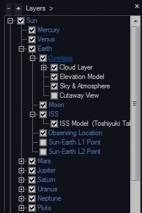
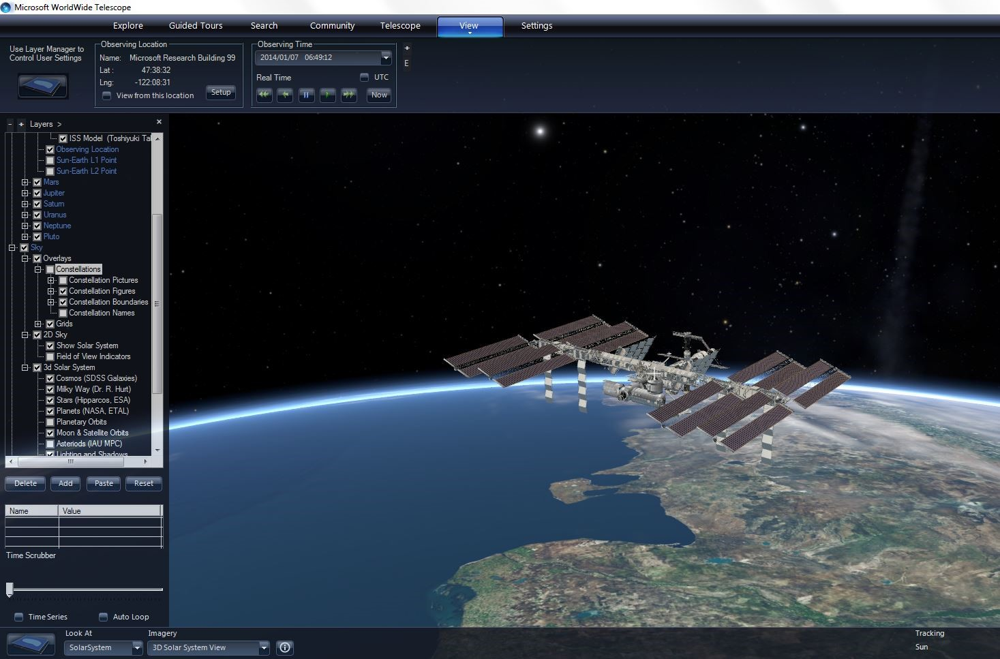
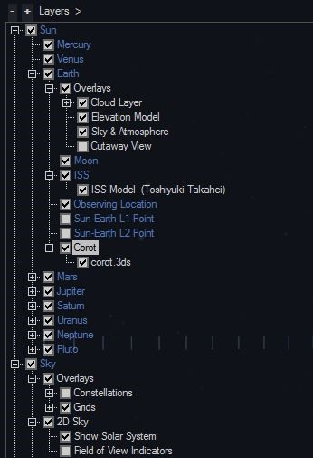

#### [3D Models in WorldWide Telescope](#wwt3dmodels)

#### International Space Station

With the latest release of WorldWide Telescope, version 5, the International Space Station (ISS) is included in WorldWide Telescope!

*   Open up the Layer Manager (click View, Show Layer Manager)
*   Open Earth node, then ISS node and click on ISS Model
    *   The first time you do this, WWT will silently download the model so it may take a little while to show up depending on your internet connection. 
*   Right click on the ISS Reference Frame (not the ISS Model) and click Track this Frame
    *   If the ISS model has completed downloading, you should see the model in orbit around Earth (pan around a little if you don’t see it right away). 
*   Try turning on Observing Time (View button) and you’ll see the space station orbiting in its actual orbit around Earth!

(ISS Model Credit: Toshiyuki Takahei)

#### 3D Models

Several [3D Models](/Download/TourAssets#models) have been made available on the WorldWide Telescope website. These 3D Models are embedded in WWT Layer files; where possible, the models have placed in realistic locations in relevant positions and orientations; accurate orbits have been created for relevant models.

To load and view a 3D Model:

*   Navigate to [http://www.worldwidetelescope.org/Download/TourAssets](/Download/TourAssets).
*   Select the 3D Model you’d like to view (for example, Corot)
*   Click on the Corot link which will download the Corot Model in a WWT Layer
*   Open the Corot Layer File (either by double clicking on the file or clicking Explore – Open – Layer)
    *   The 3D Model will be loaded in the Reference Frame in which it was saved
*   
*   If the Layer Manager is not already open, ensure it is opened (View – Show Layer Manager)
*   Navigate through the Layer Manager to see the Reference Frame (for Corot: Earth – Corot)
*   Right click on Corot Reference Frame and click Track this Frame
    *   WWT will jump to the Corot 3D Model

Try turning on Observing Time (View button) and you’ll see Corot orbiting in its actual orbit around Earth!

You can also add your own 3D Models (OBJ and 3DS formats) into WWT using the Layer Manager.
