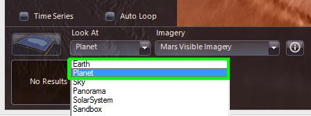
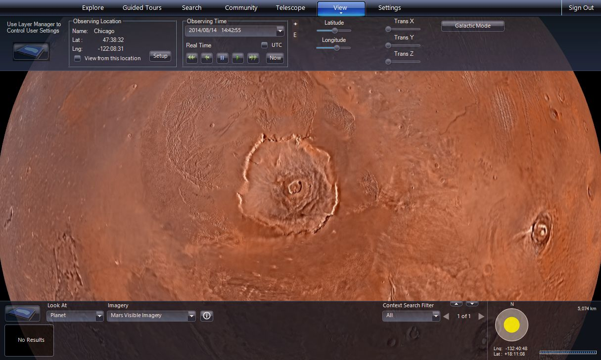
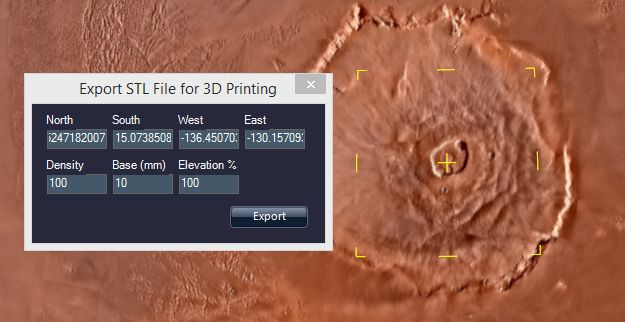
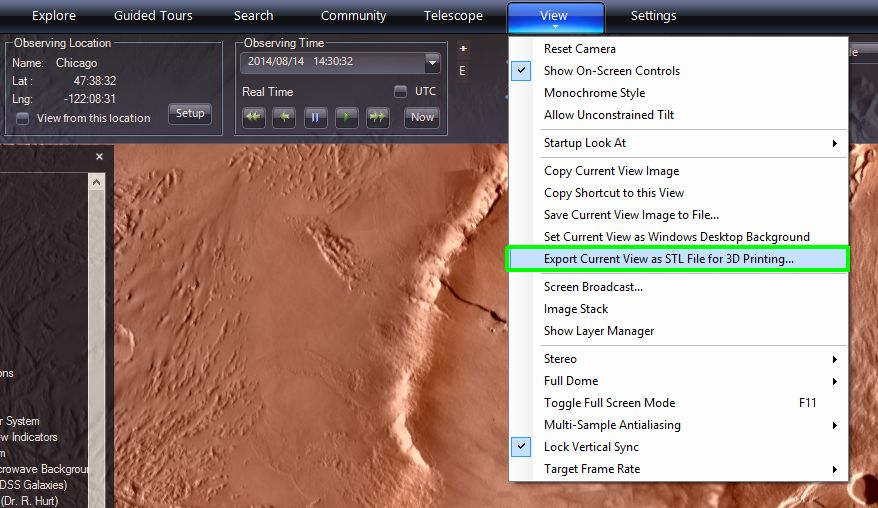

#### [3D Printing from WorldWide Telescope](#3DPrinting)

You can print 3D terrains from Solar System bodies from WorldWide Telescope. This could be done to create a 3d model of mountains, canyons or other terrain. Currently 3D surface data is available for the Earth, the Moon and Mars. You can select a region and then use WWT to create a file for printing in the Standard Tessellation Language (STL) format.

##### Steps

1.  Startup WorldWide Telescope.
    
2.  Set the **Look At** mode to the **Earth** or the **Planet** of your choice. For this example, we will use Mars. Select **Look At** to be **Planet** and then in the selection to the right select **Mars Visible Imagery**.
    
3.  Move the view to show the region you want to print. In this example we will make a model of Olympus Mons, which is the largest mountain on any planet of our Solar System – almost three times as tall as Mount Everest's height above sea level.
    
4.  To print the terrain that is in view, choose **Export Current View as STL File for 3D Printing…**
5.  This will show a default region selection in yellow and bring up a dialog box where you can adjust exactly what is printed.
    
6.  First you should make sure to define the region of the surface terrain you want to print. You can grab and adjust one of the yellow region handles in the main view or enter the latitude and longitude coordinates in decimal degrees in the box.
7.  Next you can select the **Density** of model. Higher densities show more detail but the file sizes will be larger.
8.  You can then specify the thickness of the base of the 3D printed model by changing the value of **Base (mm)**.
9.  By default the elevation is at 100%. All the planets in our Solar System are large and massive; and relative to the size of the planets even the highest mountains don’t deviate from the planet’s spherical shape. So you might want to exaggerate the vertical scale of the terrain by making the **Elevation %** to be greater than 100%.
10.  Press the **Export** button which will open a box where you can specify the location and name of the output STL file.
11.  You can then print out the STL file on your attached 3D printer using a program, such as “3D Builder” or “MakerBot Desktop”.
