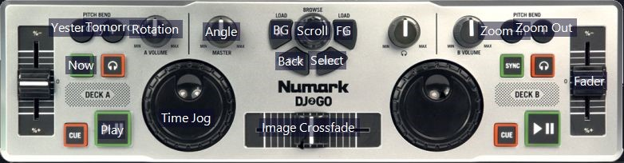
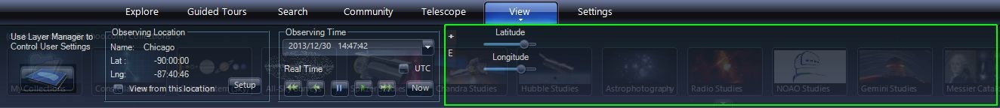

# [Controllers & Virtual Buttons](#controllersandbuttons)

MIDI (Musical Instrument Digital Interface) is a protocol for connecting commodity controllers, such as MIDI keyboards, control panels, foot pedals or any other MIDI capable USB device. WWT provides a setup panel for users to map keys, buttons, knobs, sliders and foot pedals to nearly all of WWT functionality. Similarly, WWT allows custom mapping to an Xbox game controller.  This functionality can be used in classroom presentations, planetarium control boards, in museum settings, and for data exploration with temporal and other controls.

**Skills Required:** You need to be able to understand how to connect your MIDI device to your computer, and use the WWT device configuration panel to map your Xbox controller or MIDI device to WWT functions.  Note, more custom MIDI devices may require coding or hardware assembly, but off-the-shelf MIDI controllers are plug and play with WWT.

Currently, WorldWide Telescope (WWT) can be controlled by a variety of controllers. Custom mapping can be done for MIDI and Xbox controllers, connected by USB to the computer running WWT as well as configurable virtual buttons.

## MIDI Controller

Any MIDI controller can be used to control WorldWide Telescope. You can re-use mapping of WWT functions created by someone else. You can also create your own or edit a previously-created mapping. Start by selecting “Settings/Controller Setup...” This brings up a dialog window where you can select a file containing the mapping functions. For the Numark DJ2Go you can [download a standard mapping file](@Model.ResLoc/Content/Learn/Numark%20DJ2Go.wwtmm).

You can save and load different files with different mappings.

Highlighting a device in the list of MIDI devices on the left and clicking “Properties” below will bring up the Controller Properties window that presents the status of the controller and location to the image file used for mapping. Note, that this image can be specified as a URL, such as

@Model.ImgDir/learn/numark_djtogo.jpg

or it can point to a local file, such as

\Documents\MIDI\numarkdj2go.png.

To remove an existing binding, select it in the list and click the “-” button. A box will come up to ask you to confirm the removal of the control.

To remove an existing binding, select it in the list and click the “-” button. A box will come up to ask you to confirm the removal of the control.

To add a new binding, click the “+” button. This will bring up a box saying that WorldWide Telescope is listening to the controller waiting for you to manipulate a control that has not been previously mapped. When such a control is moved, it will ask for the control type; select one of:

*   **KeyPress** — detects that a key has been pressed and does some action.
*   **KeyUpDown** — this sets up two actions, one when the key goes from Down to Up and the other from Up to Down. These can be defined separately.
*   **Slider** — linear slider from one value to another
*   **Knob** — rotating know from one value to another
*   **Jog** — jog dial that can be move spun repeatedly, often used in advancing time

Once you have selected the control type it will be added to the list of control bindings with the Control Name the same is the ID number. You can then define what you want to happen when you manipulate the control. When you select a control binding the properties are shown below the list and you can change or set the following properties:

*   **Binding Target Type pull-down** — Categories of actions that can be sent to WWT.
*   **Bind Type pull-down** — Ways to bind the controller to WWT.
*   **Property pull-down** — Specific properties controlled.
*   **Repeat checkbox** — If this is checked, holding down will continuously send the same command. This makes sense for actions like zooming.

A full list of potential bindings is available in an Excel spreadsheet [here](@Model.ContentDir/learn/Binding%20Properties.xlsx).

The labels for the functions can be placed on the position of the corresponding knob on the image for the controller. In the case of the default map this has already been done. Click the function in the list and hold and drag onto the image. Release your mouse when the label is at the desired location. Note that when the “Monitor” box is checked and the key is pressed on the controller the label changes from white to yellow.

## Xbox Controller

WWT can be controlled by a PC version of an Xbox Controller. This is an excellent interface to use in a planetarium or presentation environment because the controller is portable and the buttons can be distinguished in the dark.

WWT comes with a standard binding of functions. This default is for the left/right triggers to zoom out/in. The right bumper steps through objects in the context menu (at the bottom of WWT screen). The left thumbstick pan and scroll and the right thumbstick rotates the view. The Back key steps backwards and the Start key steps forwards through LookAt modes (Sky, Earth, SolarSystem etc.). The ABXY keys are defined in the table below.

<table class="table">

<thead>

<tr>

<th>Look At Earth</th>

<th>Look At Sky</th>

<th>Look At Solar System</th>

</tr>

</thead>

<tbody>

<tr>

<td>**A**</td>

<td>Equatorial Grid</td>

<td>Asteroids</td>

</tr>

<tr>

<td>**B**</td>

<td>Constellation Boundaries</td>

<td>Milky Way Model</td>

</tr>

<tr>

<td>**X**</td>

<td>Clouds</td>

<td>Ecliptic Overview</td>

<td>Planetary Orbits</td>

</tr>

<tr>

<td>**Y**</td>

<td>Clouds</td>

<td>Constellation Figures</td>

<td>3D Stars</td>

</tr>

</tbody>

</table>

Default mappings appropriate for print or reference is available [here](@Model.ContentDir/learn/Xbox%20Controller%20Mapping.pdf).

In order to define your own settings select “Settings/Xbox Controller Setup...” This brings up a dialog window where you can select a file containing the mapping functions. Check the “Use Custom Mappings” box and you can see the default mapping and change any of them. You can control the properties in the same way as the MIDI controller, described above. Checking the “Use Mode Dependent Mappings” allows a different mapping to be used depending on the mode.

A full list of potential bindings is available in an Excel spreadsheet [here](@Model.ContentDir/learn/Binding%20Properties.xlsx).

You can save, load and share custom mappings files (extension .wwtxm) from this dialog box.

#### Virtual Buttons

Clicking the View button will show the View controls at the top of the WWT window. The blank area to the right of the control – identified by the green box in the image below – is a place where you can define and place custom virtual buttons. These buttons can have the same bindings as the MIDI and Xbox controllers.

Clicking the “+” key brings up a binding dialog box. You can give the button a “Name,” select “Button Type,” “Binding Target Type,” “Bind Type,” and “Property,” just like the MIDI controller, described above.

In the example above I have defined a Longitude and Latitude slider. Clicking the “E” enters an editing mode for the buttons. When in edit mode, you can rearrange the buttons. Right clicking on a button will allow you to toggle the button editing mode, change the binding properties or delete a virtual button.
