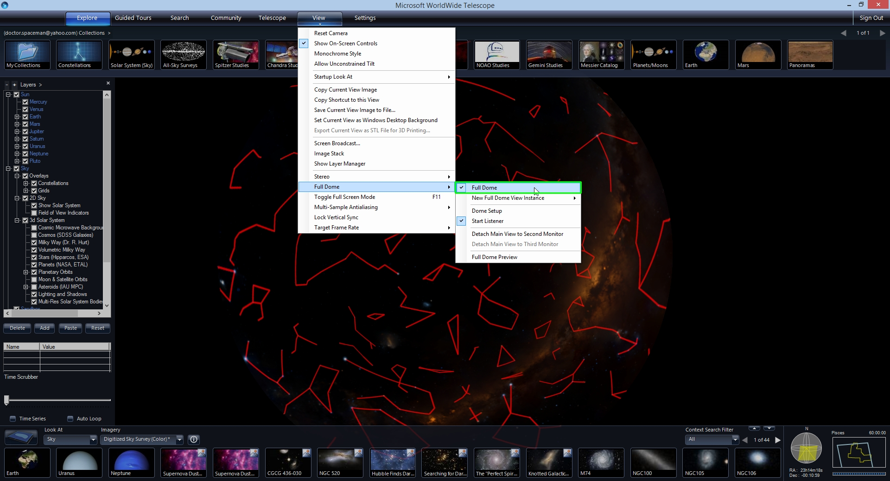
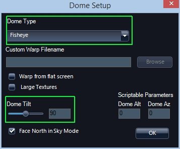
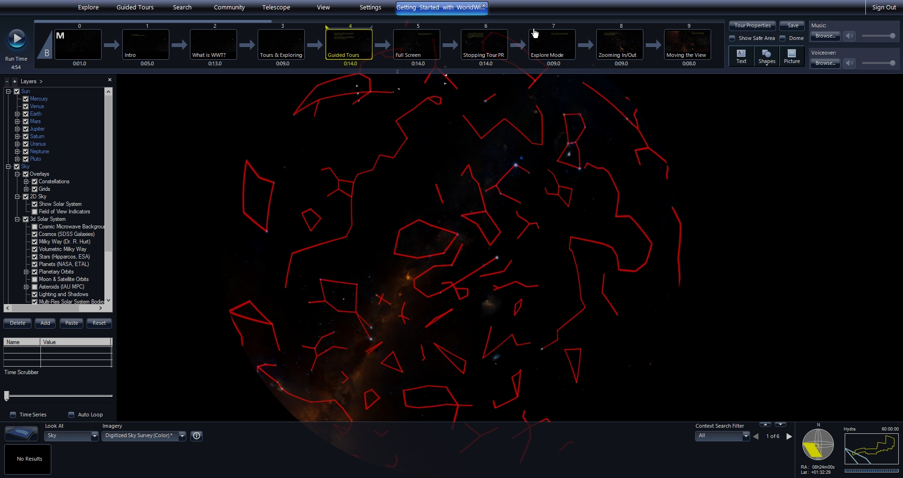
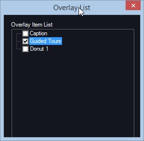
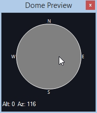
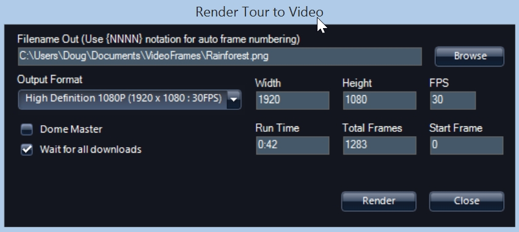
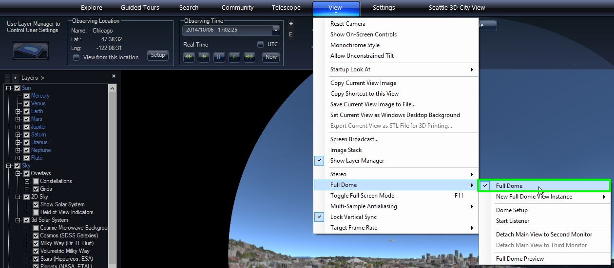

#### [Authoring for the Dome](#domeauthoring)

WorldWide Telescope 5.0 has specific functionality to enable dome authoring and playback. Technically, tours created on/for a flat display, such as a laptop, will work on the dome. However, differences in the projection and the field of view create challenges to creating content on a flat screen and having it look good in a dome. This guide will go over some function in WWT that help move between these two views.

The main window view can be changed to preview a full dome view. To go into a dome view, under the View tab, select "Full Dome/Full Dome."

**Note:** The default full dome view has a wide hemispherical view of 180 degrees. In the flat projection the default view is about 60 x 34 degrees. Where this sub-region of the full dome view is located on the dome is controlled by the dome tilt. At 90 degree dome tilt, this view will be at the Zenith and at 0 degree dome tilt it will be near the bottom of the full dome image in the front.

### Authoring on Single-Projector Systems

For systems with a single fish-eye or mirror-dome projector attached to a separate video output on the Master Server - which is probably the only computer, under the View tab, you can select “Full Dome/Detach Main View to Second [or Third] Monitor.” This will allow full-dome authoring playback on the same system. Menu and interface windows stay on the first monitor and the second or third monitor outputs drives the single full-dome projector. In this case, text positions are placed in the dome view and seen in the same way it will be viewed in a show, which facilitates the placement of their placement, as well as the pacing of motion, etc..

To setup the dome parameters, select **View/Full Dome/Dome Setup**, which opens a setup window.

Under Dome Type, you can select “FishEye,” “Mirrordome 16:9” or “Mirrordome 4:3.” You can also set the Dome Tilt. Multiple projector, or non-standard projections can be implemented by solving for projector geometries using “Settings/Advanced/Multi-Channel Calibration.” Details of this are given in a [separate document](@Model.ContentDir/Planetariums/WWT%20Multi%20Channel%20Setup%20v1.5.pdf).

If you have a single Projector Server which is different from the Master, the dome setup is the same but you will need to setup a simple 2-computer cluster, which is described in the [WWT Multi-Channel Setup document](@Model.ContentDir/Planetariums/WWT%20Multi%20Channel%20Setup%20v1.5.pdf).

### Authoring on Flat Displays for Presentation on Dome

For the remainder of this document, I will assume you are authoring on a flat screen and will be playing back on another full-dome system, which could potentially be multi-channel. WWT has specific tools to facilitate this.

In the full-dome view the size and location of overlay objects like text, shapes and images makes it hard to see them when the hemisphere is projected back onto a flat screen as a full dome preview. Usually in the flat screen you just click on overlay objects in the main view. However, it is sometimes hard to see the overlaid objects in full dome preview on a flat screen. Note, that even if you can see the objects it is hard to actually select one to move, edit, etc..

##### Full Dome Mode

On a desktop you can view the full dome view in the main window by selecting **View/Full Dome/Full Dome**. This will change the main view into a hemisphere projected onto a flat display with black area around it.

##### Overlay List

To interact with overlay objects (Text, Shapes & Pictures) in dome mode it is easier to use the Overlay List window, which is accessed under **Guided Tours/Show Overlay List**. The overlay objects have names that default to file names for imported pictures or the first line of text for text object. Shapes are named by their name followed by a number (e.g., “Donut 1”). You can always rename any overlay object by right-clicking and opening the Properties dialog.

Right-clicking on any of the images brings up a menu. Most options are the same is if you right clicked on the object in the main view. You also have an “Edit” option which is the same as double-clicking the overlay object in the main view. The Overlay List can make objects accessible when they are hard to click on in dome mode or off-screen or hidden under menu tabs.

##### Dome Preview

You can view a flat projection of a part of the full dome view using the Dome Preview. Since this is a flat projection you must make sure you are _not in full dome mode_. Make sure that **View/Full Dome/Full Dome** is unchecked. At this point you are viewing a virtual camera view of the full dome view. You can move the camera to see in detail what is being shown on any part of the dome with the Dome Preview window, which is shown by selecting **View/Full Dome/Full Dome Preview.**

As you click your mouse and move it in the grey circle in the Dome Preview the main window will show a smaller tangent view of the full dome view. The preview is centered on the Alt/Az positions shown in the lower left hand corner of the Dome Preview window which changes are you click and move your mouse.

#### [Rendering to Video](#rendertovideo)

You can use WWT to create still frames, which can be encoded into a video. Note, that WWT writes out a sequence of frames and does not do the encoding to video. You will have to use another solution to create the video and include any audio. Some suggestions are given below. Rendering out of WWT might be desired in the following situations:

*   You have a planetarium with its own video playback system.
*   You want to combine WWT images and videos with other content. For instance, this could be done to use WWT to render out a star field at a certain time and then composite a horizon or other elements in front of it. Or you might want to render some scenes in WWT and other ones in another package and then splice them together.
*   You want to distribute a video to YouTube or create a video for a presentation in PowerPoint.

##### Simple Case

In the case of a flat screen, things are pretty straight forward. Once a tour your want to render out is loaded, select Guided Tours/Render to Video. This will open the Render Tour to Video dialog box.

By default the frames are written to “VideoFrames” folder under your “Documents.” In the dialog box, you just need to specify a filename. WWT will create a sequence of frames based on that name. If you give the name “C:\Users\Doug\Documents\VideoFrames\Rainforest.png” in the dialog box, WWT will write a sequence of images named Rainforest_0000.png, Rainforest_0001.png, etc. You should also leave the output extension as PNG. Don’t change it to anything else or give the name without an extension. WWT only writes PNG files.

Also, currently for flat (i.e., non-dome) output format is set to the same resolution as the display, so if you are on a 1080x1920 display that will be the output size of the PNG images. For flat screens, don’t change these numbers and WWT only renders out 30 frames per second (FPS).

The **Run Time** and **Total Frames** are reported from the Tour. You can adjust the **Start Frame** number to begin rendering frames to some point into the Tour. This can be useful when you want to render frames in sections or make a change to a part of the tour and render those frames out. Note, there is no way to specify the end frame here, so you will have to watch the progress dialog that reports how much has been rendered and then click **Cancel** when you want to stop it.

When rendering, we recommend checking the box **Wait for all downloads**, which will force WWT to wait to load any data, tiled images, 3D terrain, 3D cities needed to render each frame. Unless you just want to make a quick small pre-visualization, the additional amount of time to wait for all data to download is a small price to pay for better rendered output.

##### Dome

To render frames for dome output you have to do the following:

1.  Make sure you are in Dome view. Select this under **View/Full Dome/Full Dome.**
2.  Open the **Render Tour to Video** dialog box.
3.  Check the **Dome Master** check box.
4.  Check the **Wait for all downloads** check box.
5.  In the **Output Format** pull-down, select one of the Dome Master formats: 1k, 2k, 3k, 4k, or 8k.
6.  Click Render to write the files.

Note that for large 4k or 8k images, writing each frame may take several seconds.

##### Making Video from Rendered Frames

Once you have your frames rendered you can make the output into a video. This functionality is not built into WorldWide Telescope, but here are some options of how to proceed.

First make sure the frames look ok and that the frame numbers are contiguous. Be careful if you render parts and try to put them together. If you do that we recommend that you render each part to its own folder and then copy the frames you want into a final folder.

If you want to add audio, you can use the voiceover and music audio files from the tour. Note, that you can include a sequence of audio files associated with each slide, but it may be easier if you combine those files outside the video encoding program and bring in just one audio file for voiceover and one for music.

QuickTime Pro ($29.99 from Apple) is a relatively inexpensive way to encode the sequence of PNG files into a video.

1.  Open the PNG images by selecting **File/Open Image Sequence…** Browse to the name of the _first file_ of the sequence. This will open the sequence in its own window.
2.  In that new window, select **File/Export**, which will bring up a dialog box.
3.  Set the output video file name and options in this box and then click **Save**.

Adobe Premiere is a more powerful way to encode video.

1.  Open the PNG images by selecting File/Import and then browsing to the name of the first file of the sequence. Check the **Image Sequence** box above the file name and click <srong>Open</srong>.
2.  In a similar way you can import your audio tracks as well.
3.  You will see your image sequence and audio if you imported that in the media browser in the lower left panel. Drag the image sequence and audio files into the timeline in the lower right.
4.  To output the video, select **File/Export/Media…**. You can change any of the export controls in the dialog box and when you are happy click the **Export** button.
