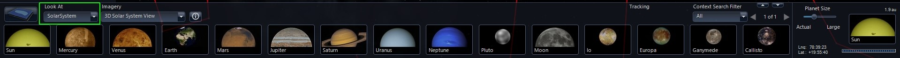
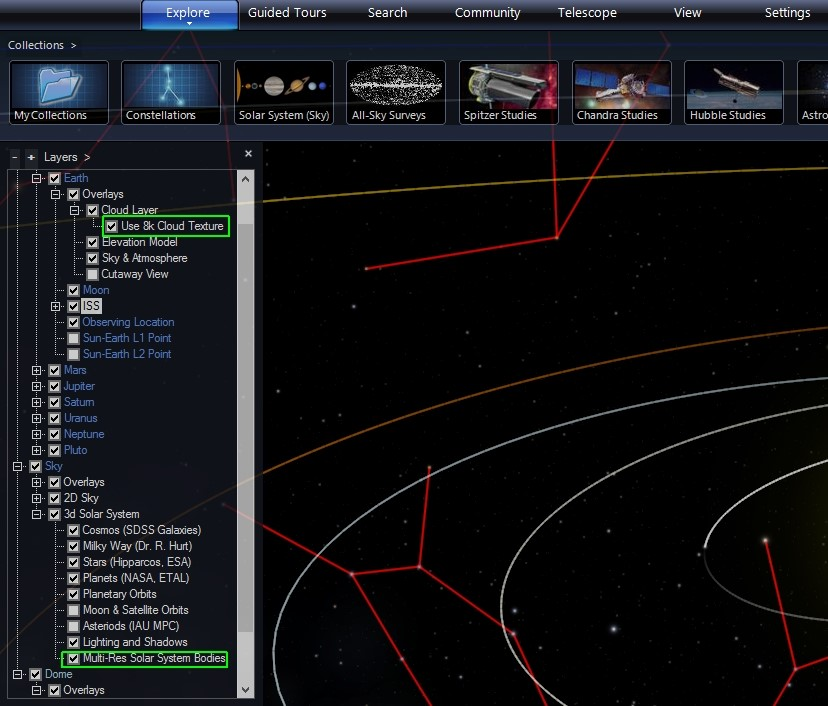
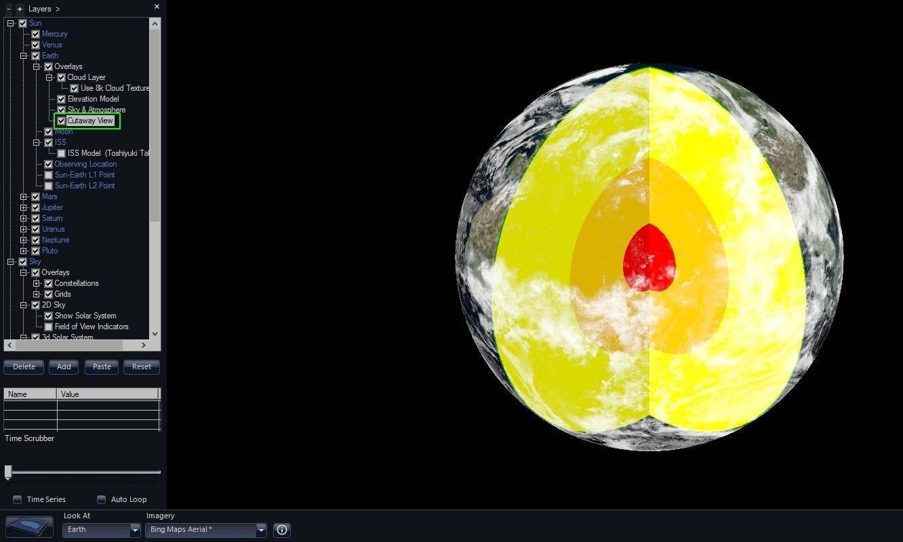

#### [Introductory Earth & Planet](#earthplanet)

In addition to looking at the sky in various ways, WorldWide Telescope can view planets from orbit or the surface. In order to do this we have to select **Look At** to either “SolarSystem” or “Planet”. Looking at the Planet isolates the planet and does not show the sky as a background. Your motion is also only relative to the center of the selected planet.

You can also **Look At** SolarSystem. This allows you to investigate all the bodies of our solar system. For this example we will explore Earth as it has the largest amount of information. First, we have to enable the display of the most detailed datasets. This is done in the **Layer Manager** controls on the left side of the screen or selected **Show Layer Manager** under the **View** menu. Under 3d Solar System, make sure “Mulit-Res Solar System Bodies” is checked.

Now under the Earth object you can adjust what datasets you see. To see the most realistic clouds, select “8k Cloud Textures.”

In order to see some additional data you will have to be **looking at** the Earth rather than SolarSystem. Let’s select that now.

One interesting thing you can do is view a cutaway of the Earth that shows the interior layers of structure. You can select this view in the Layer Manager on the left.

Let’s put the Earth back to together and look at how we can view the surface.

By default Earth views show 3d terrain and aerial data from Bing Maps. Note, that when **looking at** the Earth there is not a sky behind to view so atmospheric effects will be different than when viewing Earth in the **Look At** SolarSystem mode.

Explore Earth and the Planets in WorldWide Telescope to experience the Solar System yourself!
