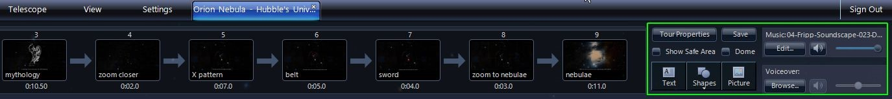
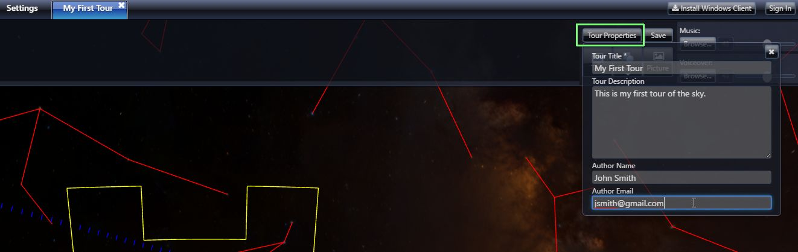
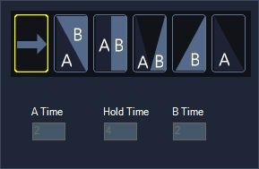

#### [Getting Started with Authoring Slide-based Tours](#slidebasedtours)

WorldWide Telescope can be used to explore the universe but it can also be used to capture your exploration or create a structured presentation that you can share. These sharable experiences are called tours. The simplest type of tour uses Slides which is similar to PowerPoint. Slide-based tours are different in that they have a start and end position for the viewpoints as well as for objects like text and image. There are two ways you can get started to create a slide-based tour, either modifying an existing tour or building one from scratch.

You can open a tour that someone else has created and edit it. This allows you to see what others did to create the tour and make changes to it on your own. To find a tour to start with Click on the “Guided Tours” tab at the top of WorldWide Telescope. You will see a collection of Tours organized by categories, such as “Learning WWT,” “Nebula,” “Galaxies” etc.. Click into a category and you will see a representative image and title. As you mouse over the tour, a description and author will be shown. When you click on a tour, it is downloaded and when it is finished it will play on your computer. Note it will playback full-screen. If you are starting out, you probably want to watch the tour before you start to modify it. When it is finished you will be given a choice to close the tour or watch it again. Click “Watch Again” and then click the Pause button in the upper left of the window. Then click “Guided Tours/Edit Tour.” When a tour is in edit mode, you see controls to edit Tour Properties, Music, Text, Pictures etc. in the upper right as shown in the screenshot below.

Another way to get started it so begin with a blank canvas. To do that select “Create New Tour” under the “Guided Tours” tab at the top. This will bring up a Tour Properties box. You must provide a Tour Title, but all other fields are optional.

1.  Use WWT to setup the initial view for the Tour. Setup Look At Sky if you want to show images of the sky or Look At SolarSystem if you want to fly around the Solar System.
2.  Once you have the first “Add New Slide” at the top left of the WWT window. This will create an initial slide and choose a thumbnail image from the current view for it. It will also setup a default duration for the slide, which is 10 seconds. You can adjust this by clicking in the time field and with typing the time or using the little up and down arrows on either side of the time.
3.  It is helpful to have slides numbered automatically, so I usually select “Show Slide Numbers” from the “Guided Tours” menu. Note, this option is only available when you have a tour loaded. In addition to numbers it is useful to label slides by clicking the bottom of the slide thumbnail above the time field.
4.  You now have a slide with an initial view. You now should set an ending viewpoint for the slide. Throughout the duration of the slide (default is 10 seconds) the viewpoint will smoothly change between the beginning and ending camera positions. To set the end slide position, change the viewpoint (e.g., pan to another part of the sky, zoom-in etc.). Then right-click on the slide and select “Set End Camera Position.” Note, there is a yellow ear on the top left of the slide when you are looking at the start position and on the right hand part of the slide when looking at the end camera position.
5.  Now you have a 10-second tour consisting of one slide. Go ahead and press the Play button to see how it works.
6.  When showing the end camera position of the first slide, click “Add New Slide” again. This will add a second slide using the end camera position as the starting position for the new slide. If a sequence of slides is intended to show contiguous motion, you should make sure that the end camera position of one slide is the same as the beginning camera position of the next one.
7.  You can continue these steps to create a sequence of slides.
8.  Between every two slides there are various transition options, shown below. Note that some transitions take time which is taken out of the start time for the second slide (Slide B). Note that the transitions can be thought of as being added on top of camera motion defined by the slides. 
    1.  The default arrow means that the slide moves from the end of one slide to the next without pause. This is used for contiguous motion.
    2.  The A\B transition is a cross-fade between two viewpoints.
    3.  The A|B transition is a hard cut between two viewpoints.
    4.  The A\/B transition is one that fades through black between two viewpoints.
    5.  The /B transition is a hard cut from A to black and then fades in B
    6.  The A\ transition fades out to black and then does a hard cut to B.
9.  You can also add elements – Text, Shapes and Pictures – to slides.
    1.  Clicking “Text” shows a text dialog box where you can enter text, select font and font-size, foreground color, background color, background options (e.g., tightness of box around text). The last menu option gives you the ability to add dynamic fields, such as Date, Time, Longitude, Latitude etc.
    2.  You can add built-in shapes, such as circle, rectangle etc.
    3.  Finally, you can add pictures.
    4.  By default, all objects that are added stay in the same place on the screen throughout the slide. However, once added, you can right-click on an object and click “Animate.” This enables you to specify how the object should look at the beginning and also the end of the slide. Once an object is animated, you can right click on the slide and “Show Start Camera Position” and then change the location, size etc. of the object and the right-click and “Set Start Camera Position.” You can do this again for the end positions changing the end characteristics of animated objects. You can also turn off animation. It will default to whatever slide position is showing (Start or End).
10.  If you have a long tour it is time-consuming to watch the entire tour to see the effect of a change near the end. You can right-click in any slide and select “Preview Tour From Here” and the tour will play from that location, including audio.
11.  You can reorder the slides by clicking a slide and moving it to a new location in the slide set. You can select multiple slides by holding down Control while clicking on slides; selected slides will be outlines in yellow.
12.  When the tour is stopped but in Edit mode, you can move up and down through the sequence of slides using Alt+Page Up and Alt+Page Down keys.

There is special type of slide called a Master Slide. Overlay elements (Text, Shapes and Pictures) remain on all subsequent slides until another Maser Slide is encountered. You make a slide a Master slide by right-clicking and selecting “Master Slide.” This also affects audio. Audio on a master slide continues to play through subsequent slides until the tour hits another Master Slide.

When you are want to save the tour, you can click the Save button in the upper right or you can select “Save Tour As…” from the Guided Tours menu. This tour file (with the .wtt) can be shared with your friends and they can see your tour on their machine (assuming they have WorldWide Telescope installed).
