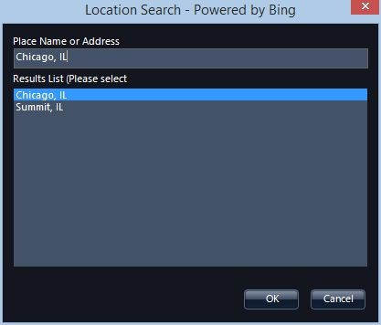
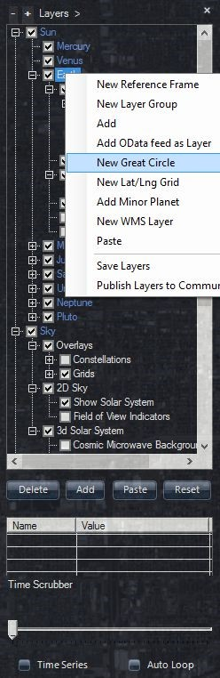
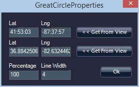
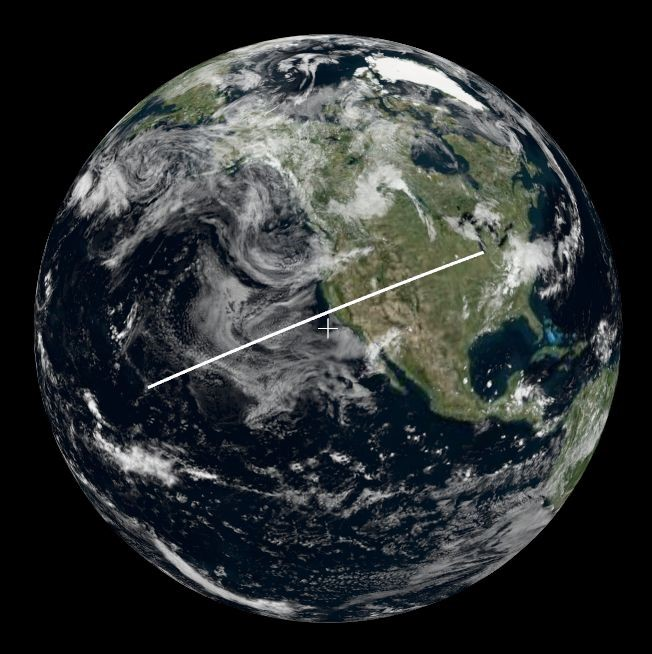

#### [Great Circle to Show Route](#greatcircle)

In visual storytelling, sometimes you want to show a time-varying path from one point on a globe to another—think of the flight paths in the movies, _Raiders of the Lost Ark_ or _The Amazing Race_. WorldWide Telescope makes this easy to do. In this documentation, we will add an expanding great circle from Chicago to Hawaii.

First, download the tour, Chicago-Hawaii Great Circle Route.

1.  Download [Chicago-Hawaii Great Circle Route.wtt](@Model.ContentDir/Tours/Chicago-Hawaii Great Circle Route.wtt)
2.  Open WorldWide Telescope
3.  Click **Explore** and select **Open**, and then **Tour**
4.  Navigate to the **Chicago-Hawaii Great Circle Route.wtt** file on your computer and click **Open**
    (Note that double-clicking this Tour directly from the file system will autoplay the Tour)

This opens the example tour. You should now see the **Chicago-Hawaii Great Circle Route** tour the top menu bar of WWT. Play this tour to get an visual example of how this functionality works.

To create a Great Circle Route:

1.  Go into **Earth** mode.
2.  In the **Search/Find Earth Based Location…** enter **Chicago, IL**. This will orient the view to center and zoom in on Chicago.
    
3.  Open the **Layer Manager**, right-click **Sun/Earth**, and select **New Great Circle Route**.
    
4.  The top Lat/Lng coordinates are the start of the route and the bottom coordinates are the end position. Since you are already centered on Chicago, which is our starting location, click top **<< Get From View** button, and then click **Ok**.
    
5.  This will create an object entitled **Great Circle Route**. Right-click it and select **Rename** and give it a more descriptive title: **Chicago-Hawaii Great Circle**.
6.  Next, set the end location. Open **Search/Find Earth Based Location…** and enter **Mauna Kea, HI**. This will center your view on the big island of Hawaii and zoom into the top of the large volcano, Mauna Kea, where some of the world’s most powerful telescopes are located.
7.  Right-click **Chicago-Hawaii Great Circle** and select properties. To enter Hawaii as the end position, click **<< Get From View** next to the lower Lat/Lng position.
8.  Zoom out to see the entire Great Circle.
    

To make a slide that starts in Chicago rotates the Earth as the circle extends in time, make a new tour

1.  Click **Explore/ > New > Slide-Based Tour…** Give it a title, **Chicago-Hawaii Great Circle Route**.

A tour can display the great circle route in either Solar System mode viewing Earth or in the Earth mode. For this example, we will be in **Solar System mode** viewing Earth.

1.  Center your view on Chicago and then in the slide editor panel at the top, click **Add New Slide**.
2.  Right-click the **Chicago-Hawaii Great Circle** object under **Sun/Earth** in the **Layer Manager**, and select **properties**. Change the **Percentage** field to **2**. The view should still be centered on Chicago.
3.  Right-click the slide and then select **Set Start Camera Position**.
4.  Move the view to Hawaii. Perhaps you might zoom in slightly.
5.  Edit the properties of the **Chicago-Hawaii Great Circle** object again. Change the **Percentage** field to **100**. The view should still be centered on Chicago.
6.  Right-click the slide and then select **Set End Camera Position**.
7.  Press the Play button, which should start the view in Chicago and then rotate the Earth from Chicago to Hawaii. The path extends with the rotation.
