#### [Guided Tours](#guidedtours)

Guided tours drive WorldWide Telescope to show visuals to present a topic or tell a story. Tours show data as a series of slides with transitions between view points and visualizations.

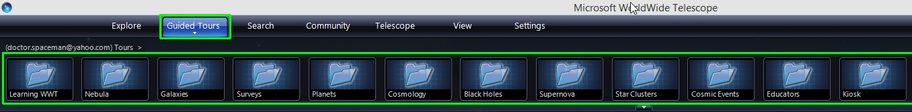

You can browse a library of tours by clicking “Guided Tours” tab. You can also save and share tours yourself. If you are browsing from within WorldWide Telescope, you will see a list of categories, such as “Learning WWT” and “Planets.”

Within each category is a list of Tours; as you mouse over each you will see a description and can download it by clicking the Play button.

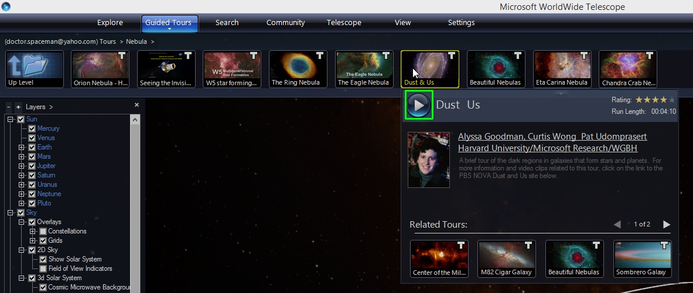

Some tours take a few seconds to download. When it is finished downloading, the tour title will show up right of the uppermost menu. If you interrupt the tour to explore you can return to the tour by clicking the title.

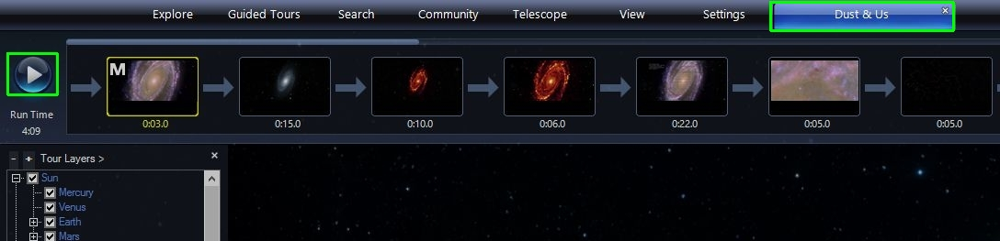

Pushing Play after the tour is downloaded starts the tour. Tours play full screen. If the mouse is over the menus they will keep on top of the tour, so move it to the display to hide all menus.

You can hit F11 to go back and forth between a windowed and full screen view of WWT.

When the tour is running you can skip to a slide by clicking on the desired slide or use the arrow keys to go forward or backward through the slide list. You can pause the tour by clicking the Pause button on the left of the slides.

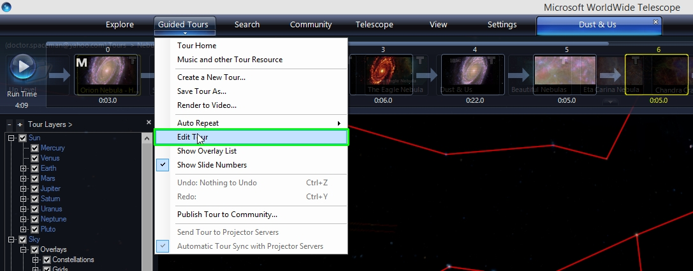

You can edit the tour and then save your changes to a local copy you can share. We will talk more about authoring tours in another tutorial, but you can start making content by first making edits to existing tutorials.

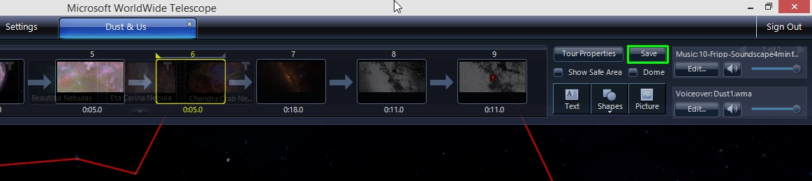

Note, tours can have separate narration and music tracks and you can adjust the volume of each separately. Once you have saved a local copy you can update that saved version by clicking the Save button.

#### [Introductory Astronomy](#IntroductoryAstronomy)

WorldWide Telescope allows you to explore real images obtained from some of the world’s most advanced telescopes. These are the same images that professional astronomers use in their research.

When you are in Explore mode, you can investigate the current view in more detail. You can zoom in and out using the Page-Up and Page-Down keys on your keyboard or the scroll wheel on your mouse. You can move your view by clicking and moving your mouse in the main window. You can also rotate the view by holding down the control key while you move your mouse.

In the left-hand part of the lower menu, there is a pull-down to select what you are looking at and what imagery is displayed. You can look at the Sky, which is what you are looking at now.

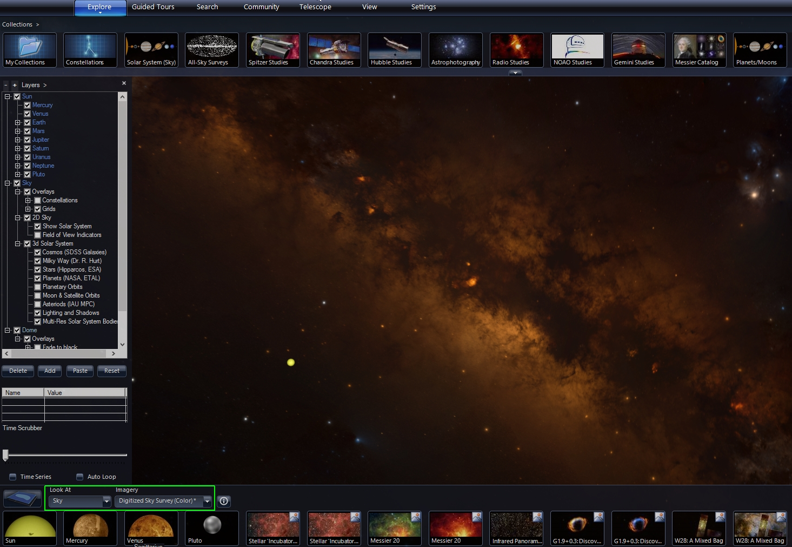

You can also select an exact image of the Sky with the Imagery pull-down. Currently, you are looking at the optical view of the Sky, as captured by the Digitized Sky Survey. You can use the Imagery pull-down to see the Sky in other wavelengths, such as this infrared view of the sky from the IRAS satellite.

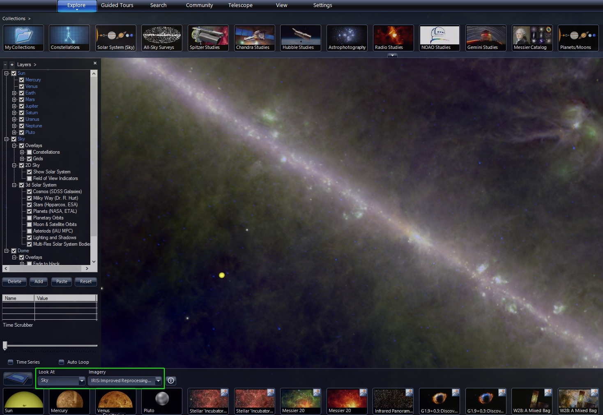

You can also look at Earth, which brings up a 3D view of our planet as seen from space. Note that this view only shows the Earth and does not include the effect of lighting from the Sun. Just a blue marble in an empty universe.

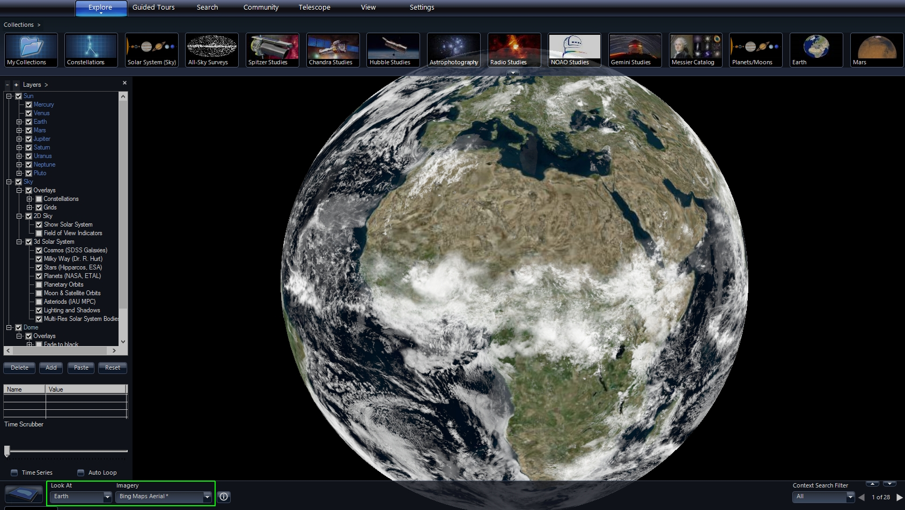

You can look at Planets, and other solar system worlds, such as Mars. These views also show just the body of interest by itself.

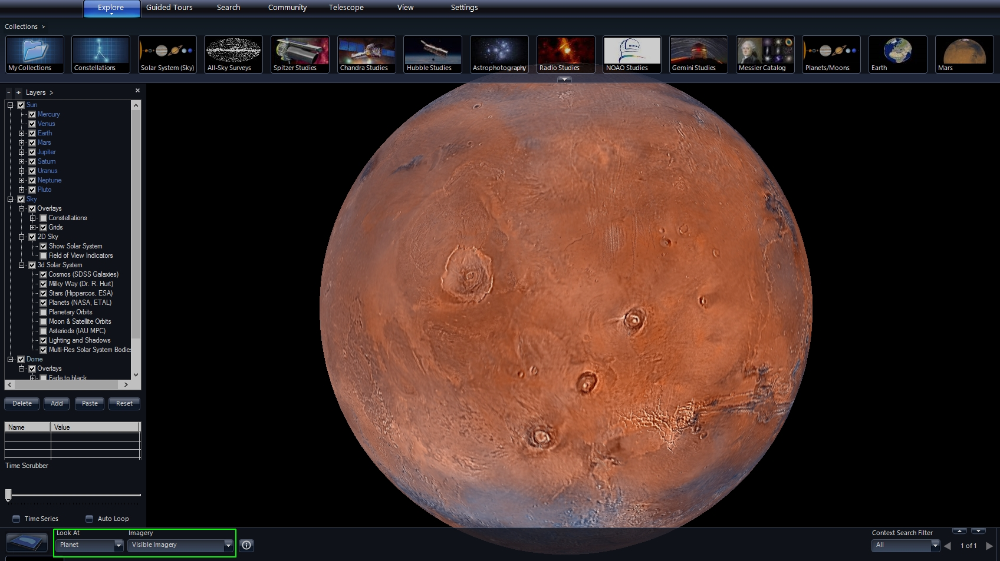

In the next viewing mode, you can look at various Panoramas, which are wrap-around images taken from the surface of Earth, Mars, and Earth’s Moon.

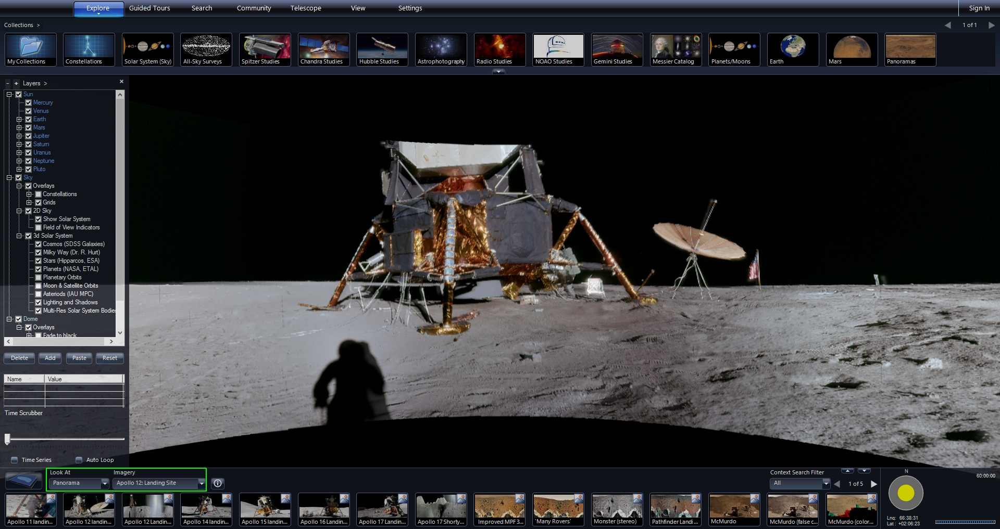

The last viewing mode allows you to explore a 3d model of the Solar System, and indeed the entire universe, at least as much of it where we have good models. The major components included are the Solar System, which includes planets, dwarf planets, moons and asteroids. Beyond the Solar System is the Hippoarcos catalog of stars. Then further out is a model of the Milky Way including a face on artistic view of our galaxy. Pulling further out galaxies from the Sloan Digital Sky Survey (SDSS) are shown.

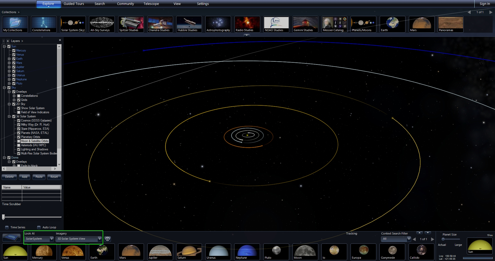
