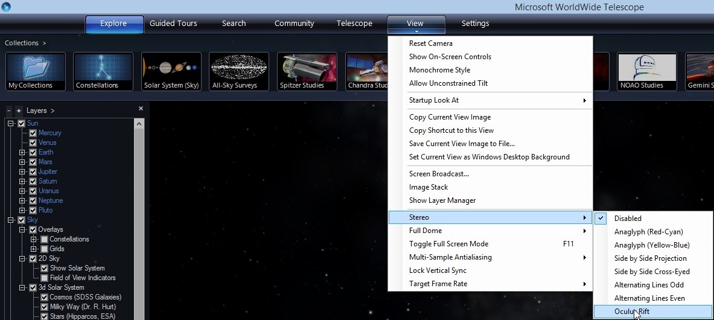

#### [Using Oculus with WWT](#Oculus)

WorldWide Telescope (WWT) works with Oculus Rift virtual reality headset as a special stereo mode. Note, currently WWT supports Oculus Rift Development Kit 1, (Oculus Rift DK1). You can use this mode by following these steps.

1.  Make sure you are running WorldWide Telescope 5.0 or later, which is available here: [http://www.worldwidetelescope.org/Download/](/Download/).
2.  Connect the Oculus to the computer.
3.  Turn the Oculus on. The Oculus will appear as a secondary monitor. If you look through the Oculus without WWT running you should see a desktop similar to what you see if you connected a secondary monitor.
4.  Note, you should try to put the Oculus over your eyeglasses.
5.  Start WWT.
6.  Enable Oculus Rift mode. Open the menu under View and select Stereo/Oculus Rift. See screenshot below.  
    
7.  The scene should be visible in the Oculus. Note the menu items are still on the primary display and the main window in the primary will go blank when outputting to Oculus.
8.  You can interact with WWT while wearing the headset. Since you can’t see the keyboard and menus, it is easier to use an Xbox or MIDI controller. However, be careful doing fast rotations with the controller, since if the motion is not coordinated with your head rotations, you can induce motion sickness.
9.  You can also download and play a tour on asteroid impacts which was created by the WWT team specifically for virtual reality. This tour, called Impacts, and additional information is available here [http://www.worldwidetelescope.org/Planetariums/Impacts](http://www.worldwidetelescope.org/Planetariums/Impacts)
10.  You can create a virtual or physical button (see [http://worldwidetelescope.org/Learn/SettingUp#controllersandbuttons](/Learn/SettingUp#controllersandbuttons)) to reset the Oculus Rift view. The function ResetRiftView is under Navigation/Action. This can be useful to set the initial orientation of the virtual environment relative the physical orientation of the Rift.
