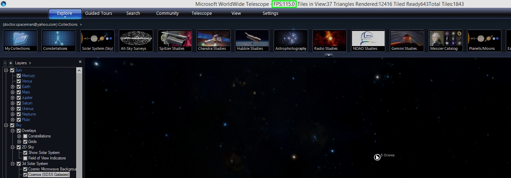
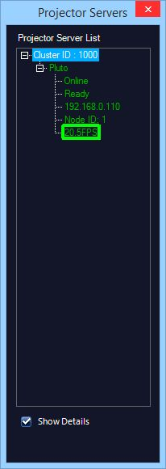
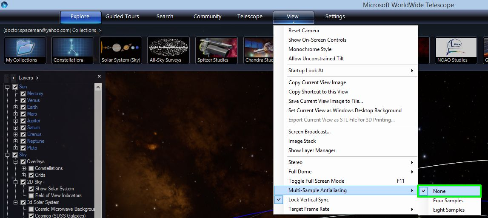

#### [Tweaking Performance](#performance)

##### Evaluating Performance

WorldWide Telescope can show many layers and types of data, but various things can affect visual performance, both interactivity and during playback. A rule of thumb is that a modern PC with a dedicated graphics card will likely perform fine for most installations. But older machines or modern ones that have integrated graphics might not be adequate for the most accurate rendering. The most immediate way to evaluate performance is to show the frame rate. This can be done by selecting: **Settings/Advanced/Show Performance Data**.

When this is selected, WorldWide Telescope displays the frames per second (FPS) along with other information about loaded data in the title bar of the main WWT window.

For cluster and dome installations, WWT can also report this frame rate for all projector servers in a GUI on the master. To show this GUI, select **Settings/Advanced/Projector Server List**. This GUI shows the status of each projector server. This example has a single projection server (Pluto) and shows whether the computer is on the network (Online), if WWT is running (Ready), the IP for the projection server (192.168.0.110) and the frame rate for that projector (20.5 FPS).

The frame rate could be capped by the WWT itself – see below – otherwise WWT tries to draw as a new frame as fast as it can and the effective frame rate is shown in the window. Frame rates of less than 30 will introduce noticeable stuttering and numbers of less than 15 FPS will be very distracting. Note that for simple scenes and fast hardware the FPS could be a large number – hundreds – much larger in fact than the ability of a projector or monitor to display it.

### Optimizing Performance

All visualization programs trade off visual fidelity with rendering time. When you are using WWT to run a live program usually you want to trade off fidelity with rendering time. In fast moving scenes where it may be hard to keep up visually without having very low frame rates, the human perception of fidelity is limited. So usually, you want to do what you can to keep FPS to 30 or above and compromise on rendering quality if necessary.

For interactive and playback uses, you can change the following settings to try to improve the performance.

##### Anti-aliasing

Antialiasing is a graphics technique to redraw lines and edges with to avoid showing them as jagged lines made up of individual pixels. Modern graphics cards can usually handle this easily. However, most integrated graphics can’t do this and thus those calculations are done by the CPU not the GPU, resulting in very poor performance. The first step in improving performance is turning off anti-aliasing. Open the menu **View/Multi-Sample Antialiasing** and select **None**. Note, changing this value will require a restart of WWT to take effect. When you have restarted play the tour again and look at the FPS and see if that has improved the frame rate adequately.

##### Content

The frame rate depends on the scene as well as the performance of the graphics hardware. Within the constraints of the graphics hardware the only other thing you can change is the content. The most difficult content to render is 3D content: terrains of planetary surfaces, 3D models, or 3D cities. Content affects performance in two stages. The first stage is data loading. Running the tour through will load the data onto your local disk cache. This is the first step, but final performance depends on how quickly you can get the data into the computer’s GPU. When you play the tour if the data is being drawn as you move through a scene then you want to make sure that data loading is done before the audience sees it. The easiest way to do this is add the have the first 1-2 seconds of the scene rendered while the display is faded to black. Then fade up from black and most of the data will have been loaded for the scene.

1.  In the lower part of the layer manager, right-click on **Dome/Overlays/Fade to black** and select **Add to Timeline**. Unless the Tour will only be shown in a dome environment, make sure the **Fade Dome Only** under **Fade to black** is _not_ checked.
2.  In the Timeline editor make a key for **FadeToBlack** at start time 00:00 and set the Opacity, which is the only sub-property, to 1, which means it is faded to black. If the timeline editor is not shown, you can expose it be selecting **Show Timeline Editor** under the **Guided Tours** tab.
3.  Then move the time slider to 2 seconds into the slide and make another **FadeToBlack** key and set it to 1 as well.
4.  Make a third **FadeToBlack** key 1 second following the second key (at 3 seconds) and set that value to 0\.
5.  Play the slide and it should be black for the first 2 seconds, and hopefully that is enough time to load the necessary data. Then between 2 and 3 seconds the scene should fade in from black.
6.  6. Adjust the time locations of the keys to keep it black for long enough to hide the data loading if the suggested times are not sufficient.

##### Target Frame Rate

WWT attempts to render frames as fast as the GPU can make them. This results in the GPU being pushed hard and will cause it to consume more power and heat up. If the GPU overheats, it can scale back its performance or shut down completely. In real-world environments, the projectors and monitors only operate at a certain refresh rate and rendering more frames per second isn’t necessary. You can set the limit on the frame rate in the menu View/Target Frame Rate. In most cases you want to choose 60 or 30 FPS.

### Rendering to Video

Interactive performance requires WWT to render the scene every frame, every 1/30 of a second. For playback that doesn’t require interactivity – for instance in a planetarium system – one way to deal with performance issues it to render the tour to a video for playback. That way, WWT can take as much time as it needs to render a frame including fetching the data, putting the scene together and finally rendering. To do this, load the desired tour. Then under the open the **Render Tour to Video** dialog box under **Guided Tours/Render to Video**. Then make sure the “Wait for all downloads” is checked before rendering. More details on rendering to video are available [here](/Learn/Authoring#rendertovideo).
