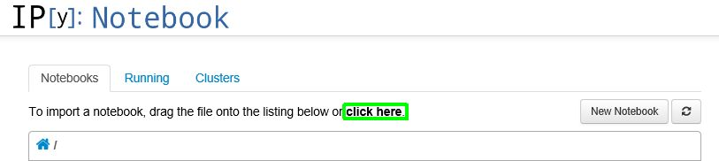

#### [Loading Data Using pyWWT](#pyWWT)

_Contributed by Mark SubbaRao, Adler Planetarium and John Zuhone, MIT._

John Zuhone wrote a very nice python package – [pyWWT](http://www.jzuhone.com/pywwt/index.html) – that allows data import directly into WorldWide Telescope. Mark SubbaRao used this package to load and visualize extragalactic data into WWT and has written up an IPython notebook to illustrate the process.

This document will go through the install from nuts to bolts to reproduce this visualization to learn more about using the pyWWT package and WWT. In this example we assume you are using pyWWT on the same Windows machine where you are running WorldWide Telescope. You can also run the python package on a different machine running Linux or MacOS and connect to WWT on the remote Windows machine over the network.

There is good documentation on installation and usage of pyWWT on the project website - [http://www.jzuhone.com/pywwt/index.html](http://www.jzuhone.com/pywwt/index.html). Below we take through one specific path, which will be useful if you are new to Python.

### Step 1 - Installing Python (Anaconda)

1.  First download the Anaconda Python distribution [https://store.continuum.io/cshop/anaconda/](https://store.continuum.io/cshop/anaconda/). You don’t have to use this distribution, but instructions on adding the packages that pyWWT depends on will be specific to Anaconda. Note, you will have to provide an email to get to the download page. When you install the distribution, it is easier to install it for “Just Me”, rather than for “All Users.”

    Anaconda Python this includes most of the packages that are needed by pyWWT. If you are using another Python distribution, you will have to make sure the following are installed:

    *   NumPy
    *   Matplotlib
    *   AstroPy
    *   Beautiful Soup 4
    *   Requests
    *   Dateutil
2.  The only extra package you need to install is astroquery. First download and git - [http://git-scm.com/download/win](http://git-scm.com/download/win). Run the installer and take the defaults until the page on “Adjusting your PATH environment.” On that page, select “Use Git from the Window Command Prompt.” 
3.  Now open the “Anaconda Command Prompt,” accessible through Windows Start Menu. Note, if you installed Anaconda for All Users, you have to run the command prompt as administrator.
4.  Install astroquery package:
    `> pip install git+http://github.com/astropy/astroquery.git#egg=astroquery`
5.  While the Anaconda Command Prompt is open, install pyWWT:
    `> pip install pywwt`

### Running IPython Notebook

Mark SubbaRao created an IPython Notebook to import and visualize extragalactic datasets.

1.  First download the Notebook [here](@Model.ContentDir/learn/Visualizing Extragalactic Data in WWT.ipynb).
2.  If it is not open already startup the “Anaconda Command Prompt.”
3.  Open up the Notebook viewer in a web browser:
    `>ipython notebook`
4.  Import the downloaded Notebook by either dragging the “Visualizing Extragalactic Data in WWT.ipynb” file to the IPython Notebook viewer or clicking “ **click here**” at the top and navigate to the file. 
5.  After importing it click the blue “Upload” button.
6.  Click on the Notebook title. This should open up the Notebook in a separate tab. The Notebook is made up of a series of cells, which can have various types of information, including code. The current cell is indicated.
7.  Click the “Run Cell” button, which will move past the first text cell to the first part of code “In[1]” 
8.  When you get to the “In[2], which Acquires Data from GAMA database a status bar at the bottom of the cell will show the progress of downloading the database (2.6MB). Wait for the file to finish downloading and then run the next cell.
9.  Before connecting to WWT using LCAPI, startup WorldWide Telescope. In this example, we are running on the same machine. If this is not the case, you can start it on the remote machine and then give the IP address of the WWT machine in In[4].
10.  When you execute In[5], you will see a new “GAMA Galaxies” layer appear in the Layer Manager.
11.  You can view this in SolarSystem mode and fly out to see the new dataset as well as the SDSS Galaxies shipped with WWT. Note, in the Layer Manger SDSS galaxies are called “Cosmos (SDSS Galaxies)”.
12.  You can also switch to Sky mode and then right-click on the “GAMA Galaxies” layer and bring up the properties dialog box. In the Scale tab, use the slider to set Scale Factor to 16\. In the Markers tab, select the “Marker Type” to be “Circle.” Then when you view the patch of sky where the GAMA galaxies are found and zoom in you will see the positions marked as circles.
13.  You can edit the code to create other data columns in the Notebook and rerun to make a new data layer and play with adjusting the interactive visualization.
