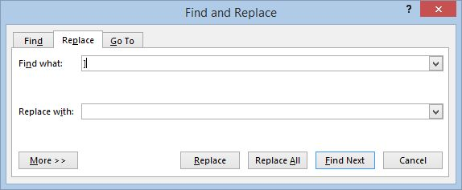

#### [Creating a Traverse Trail Layer](#traversetraillayer)

Tutorial contributed by A. David Weigel, Christenberry Planetarium, Samford University.

##### Layers

WorldWide Telescope can show many layers and types of data. A layer is an object or a dataset that can be placed into your viewing window. There are many types of layers you can create, such as importing 3D objects, or displaying aurora evolution over time overlaid on the high latitudes of the Earth. This tutorial will demonstrate how to create a layer that displays the traverse trail of the Curiosity rover on Mars within Gale Crater towards Aeolis Mons (Mt Sharp). The Layer Manager is located in the lower left of the screen and can be toggled on/off.

Within the Layer Manager, you can check boxes on and off to show the different visualizations that are built into WWT. Expanding the **Earth** menu will show six children layers, including **Overlays**, the **Moon** and the **ISS**. Likewise for **Mars**, the only options are **Phobos and Deimos**.

1.  To create our own layer for Mars, we first need to ensure that the Layerscape Excel Add-In is installed for your computer, which can be found here: [http://www.layerscape.org/Home/ExcelAddInWelcome.](http://www.layerscape.org/Home/ExcelAddInWelcome)

Curiosity traverse coordinates courtesy of Joe Knapp (curiosityrover.com) can be found here: [http://curiosityrover.com/rovertrackfine.json.](http://curiosityrover.com/rovertrackfine.json)

1.  Right-click and **Save As** to save the file rovertrackfine.json. Open the file with Microsoft Word and use **Replace** (Ctrl-H) to replace the following characters enclosed in the double quotes (but don’t type in the quotes) from the JSON file with nothing: “[“ “]” “{“ “},” “}” . Save As a plain text file and ignore all prompts that formatting will be lost in doing so.

1.  Open **Microsoft Excel** and click **DATA/From Text**. Import the plain text file just saved from Word. In the Text Import Wizard, choose **Delimited** (default choice) and start import at row 2 if there is an empty row at the beginning of the data. In step 2, check the delimiter boxes for **Comma** and **Other** and in the Other box, type in a colon (:). Step 3 can be skipped and click Finish.

Once imported, add a row at the beginning of the spreadsheet and label the columns with the appropriate labels (column B will be labeled Sol, and etc.). After labeling, delete the columns that only consist of labels (every other column).

1.  Be sure to Save As and Excel Workbook and it should look something like this.

**Note:**The Excel spreadsheet used in this tutorial is available here as a reference: [Curiosity Traverse.xlsx](assets/Curiosity Traverse.xlsx).

*   **Sol** is the number of Martian day since landing (0).
*   **LMST** is Local Mean Solar Time.
*   **ET** is ephemeral time, or seconds elapsed since 1/1/2000, so subtracting ET at landing (Sol 0) from another data point gives elapsed mission time in seconds.
*   **Longitude and Latitude** are from a reference point that is defined with WWT. **Altitude** is the elevation of the rover with respect to datum, essentially sea level for Mars.

1.  Now, open **WorldWide Telescope**, go back to Excel and click on the **WWT** heading. Control-A selects all data and then click **Visualize Selection**. We are only interested in the **Longitude, Latitude and Altitude** which are automatically mapped to their respective columns in the table.

1.  Change the **Layer Name** to **Curiosity Traverse**.
2.  Change the **Reference Frame** to **Mars** (from Earth). Make sure the WWT Label matches the highlighted data and that the distance is in meters.
3.  Under the **Marker** tab change the color to lime green (shows up very well on Mars and is my favorite color). **Hover Text** should be none, **Scale Type** Constant, and **Scale Factor** can start at 1 or larger (it will be easy to find if its bigger and you don’t know where Gale Crater is located off the top of your head). Eventually we will want to change the Scale Factor to the smallest scale but we can do this through the layer property editor in WWT. **Marker Type** should be Point.
4.  Finally click **View in WWT**.

In WWT you should see the **Curiosity Traverse** layer as a child of Mars (if not, check to make sure it isn’t under Earth, in which case you need to adjust the reference frame in Excel). Make sure the layer is turned on and find Gale Crater, you will see a large green marker.

1.  You can now turn down the scale all the way by right clicking the **Curiosity Traverse** layer and selecting **Properties**. Under the **Scale** tab, slide the **Scale Factor** to a number like 0.003 or lower.

1.  Now from the **Explore/Collections/Mars** at the top of WWT, right click **Mars Orbiter Camera Imagery** and select **Add as New Layer** (be sure that it becomes a child of Mars). Right-click the layer and click **Background Image Set**. Now the rover traverse map in overlaid on a higher resolution set of images of Gale Crater.

**Note:** a copy of the traverse trail used for this tutorial in a layer (.wttl) file is available here as a reference: [Curiosity Traverse.wwtl](assets/Curiosity Traverse.wwtl).
