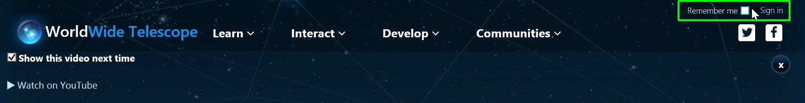
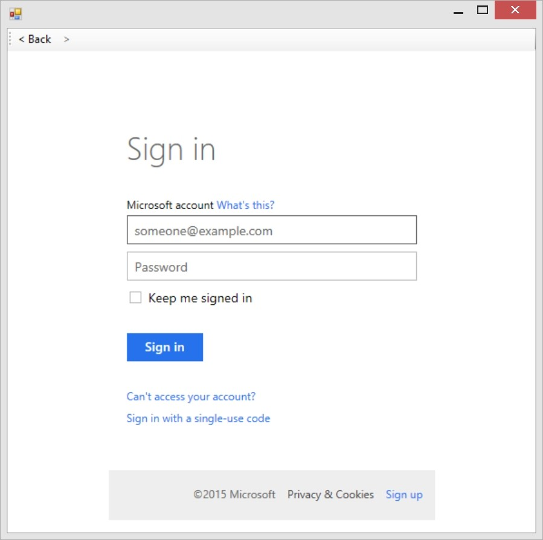
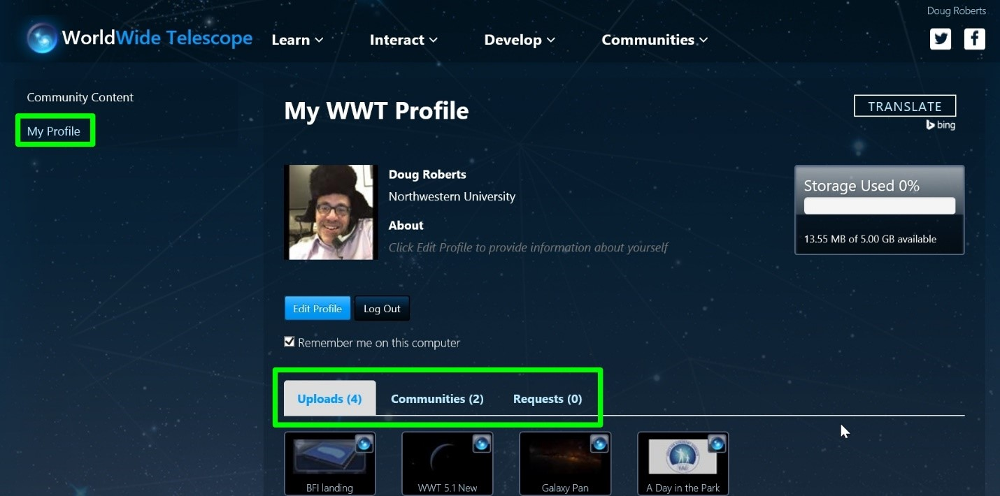
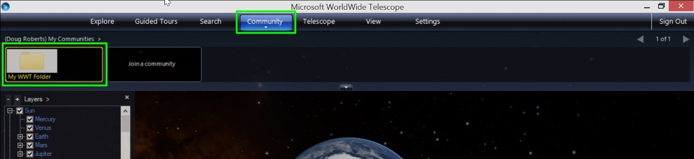
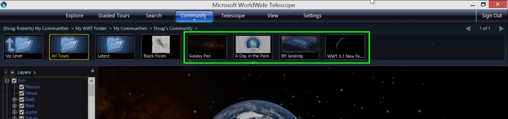
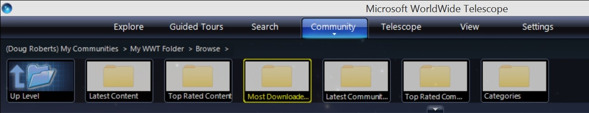

#### [Using Communities](#usingcommunities)

Content in WorldWide Telescope can be organized, curated and shared using the Communities feature.  Communities replaces the Layerscape functionality.  To get started with Communities, you first have to create an account. 

1.  Open [http://www.worldwidetelescope.org](http://www.worldwidetelescope.org)
2.  In the upper right click on “Sign-In”.  
    
3.  If this is the first time you logged in you will see a dialog box where you can create a new or login to an existing account.  
    
4.  Once you have logged into your account, you will see “My Profile” in the left navigation. Clicking on this will take you to a page showing your profile and the communities and content you have uploaded to WorldWide Telescope.
5.  You will a tab for uploaded items, such as tours. Another tab shows all of the communities you have created.  The last tab shows requests submitted to you as the owner of your communities.  Here you can approve requests to join a community.   
    
6.  You can create new communities, sub-communities and upload files to communities from the “My Profile”. When you upload a tour, the Tour Properties are used to populate the descriptive fields on the website.  You can provide a thumbnail (wide aspect ratio of 2:1) as well.  

    Similarly, you can access communities from within the Desktop Client.
7.  Once you have signed in (upper right) you can click on the Community tab to show the same community structure as the web site.  
    
8.  Clicking on “My Communities” and then “My WWT Folder” and then you can drill down to see your tours organized by community.  
    
9.  You can also Browse all tours you have access to, which includes your communities (the ones you own and the ones you are a member of) as well as the stock tours available in WWT.  
    
10.  Note that all administration of your community content is done through the Community section of the [worldwidetelescope.org](http://www.worldwidetelescope.org) website.
