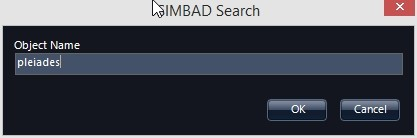
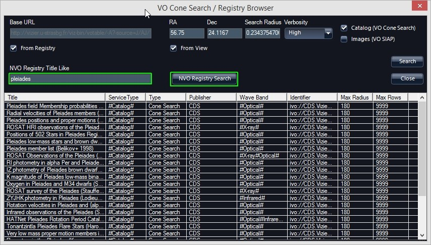
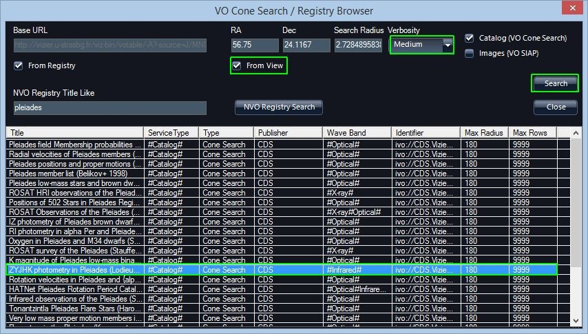
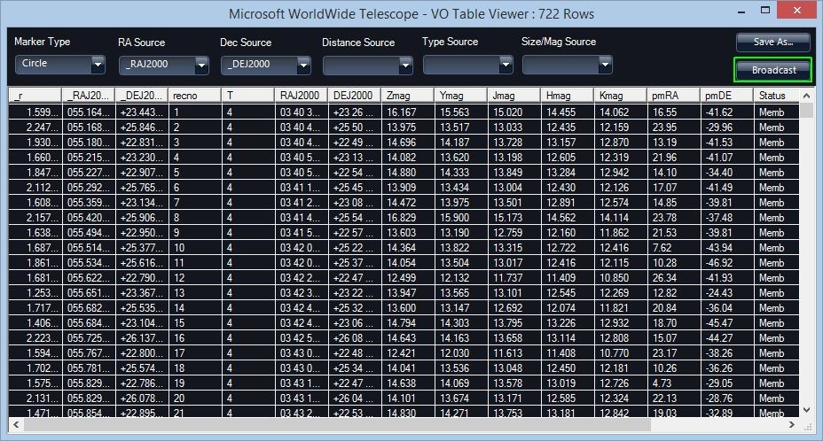
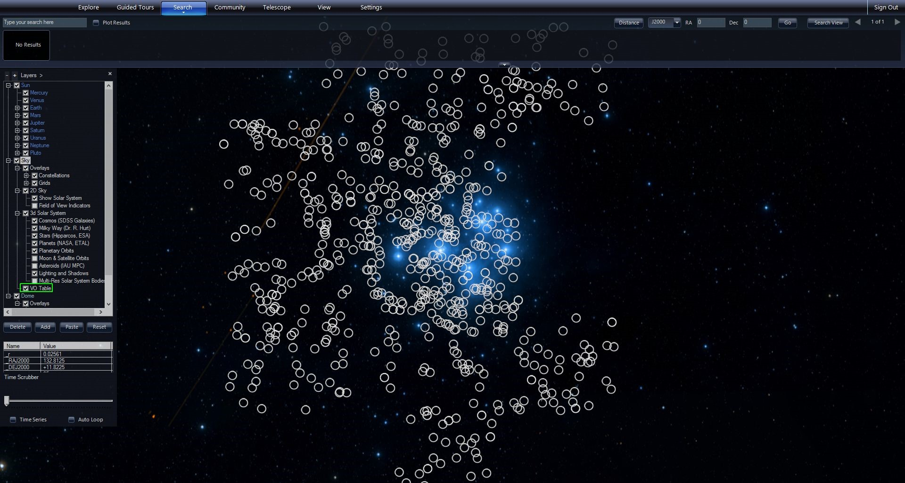
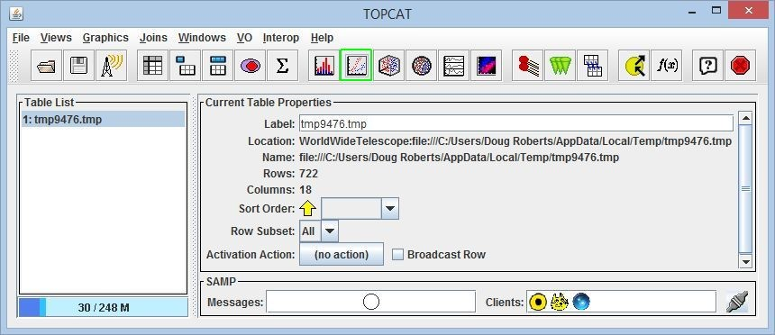
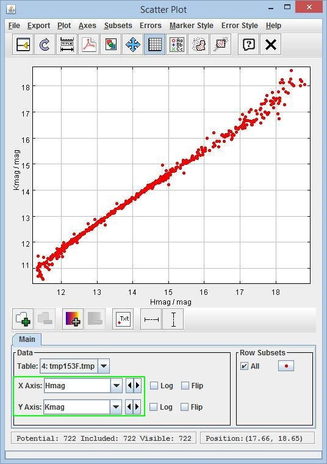

#### [Using Virtual Observatory (VO) Tables](#UsingVOTables)

VO Tables are a standard exchange format of catalog data and queries to registries allow you to find, plot and interact with a wide variety of catalogs that have VO table interfaces.

First orient the view to a location, for this example the Pleiades open cluster.

1.  Make sure you are in Sky mode.
2.  Under the Search Tab, select “SIMBAD Search…”
3.  Enter “pleiades” in the search box. This will orient your view to the Pleiades cluster and zoom in.
    
4.  Next under the Search Tab, open the “VO Cone Search/Registry Lookup…”
5.  In the field “NVO Registry Title Like” enter “Pleiades.” And Click “NVO Registry Search” button.
    
6.  This will populate the bottom of the table with a list of registries (registered catalogs in this case).
7.  Click on a row to search that catalog. This will load values into “Base URL.” For this example select “ZYJHK photometry in Pleiades…” Since you are looking at the location of the Pleiades, you can click the checkbox next to “from View.” Set the Verbosity pull-down to “Medium” in order to return photometric measurements at all observed bands, rather than the default positions if the default “Low” is used. Then click “Search” on the right.
    
8.  This will plot the catalog entries of the returned table on the background sky image. The default is to plot circles at each location. Also, this table is added as a layer (default name is “VO Table”) under the “Sky” of the Layer Manager on the left. If you close this table, you can always right-click on the “VO Table” in the layer manager and select “VO Table Viewer.”
    
    
9.  Clicking on an entry of the returned table will center the display on the location of the catalog entry and show a label.
10.  10. You can right-click on the VO Table layer in the layer manager and select **Copy** and then you can paste the table into an Excel spreadsheet.
11.  To do plotting, you can use TOPCAT, which is a free Java program available here: [http://www.star.bris.ac.uk/~mbt/topcat/](http://www.star.bris.ac.uk/~mbt/topcat/). First download _and run_ TOPCAT – by double-clicking on the topcat-full.jar file.
12.  Then in the VO Table Viewer click the “Broadcast” button. This uses the SAMP messaging protocol to send the retrieved VO Table to TOPCAT for plotting.
13.  In TOPCAT, you can then select setup a scatter plot, but clicking the icon at the top menu.
    
14.  This brings up a scatter plot window. You can map columns to axes in the plotting window.
    
15.  You can also save the current table out of TOPCAT as Comma Separated Variable (CSV) format for input into Excel.
